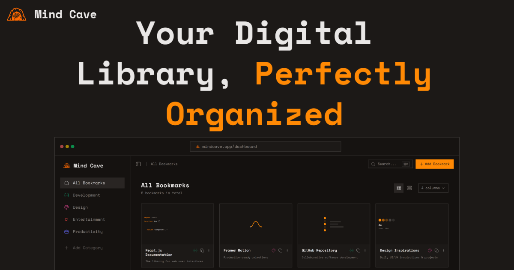

# Mind Cave

**Your Digital Library, Perfectly Organized**

Mind Cave is a production-ready bookmark manager built with Next.js and Supabase. It replaces scattered browser bookmarks with a dedicated interface that fetches metadata automatically, organizes resources by category, and works across devices.

## The Problem

Browser bookmarks are broken. Folders get nested too deep. Names are cryptic. There's no preview, no search worth using, and no sync that actually works. You save links to read later but never find them again.

## The Solution

Mind Cave gives you a single place to save, organize, and retrieve web resources.

### Core Features

- **Automatic Metadata**: Save a URL and get the title, description, favicon, and preview image without typing anything
- **Category Organization**: Group bookmarks with custom icons and colors (80+ icons available)
- **Browser Import**: Drag your exported bookmarks file and import with folder selection and deduplication
- **Custom Media**: Override auto-fetched images when needed
- **View Modes**: Switch between card grid and compact list
- **Grid Density**: Adjust layout density for your screen size
- **Context Menus**: Right-click for quick actions
- **Bulk Operations**: Select and manage multiple bookmarks at once
- **Real-time Search**: Filter instantly by title, description, or URL

### Quality

- **Performance**: Lazy loading, optimized rendering, minimal bundle size
- **Responsive**: Works on desktop, tablet, and mobile
- **Themes**: Dark and light modes with system detection
- **Security**: Row Level Security ensures data isolation per user

---

## Technical Stack

| Layer      | Technology                                 |
| ---------- | ------------------------------------------ |
| Framework  | Next.js (App Router), React 19, TypeScript |
| Styling    | Tailwind CSS v4, Shadcn/ui, Base UI        |
| Animations | Framer Motion                              |
| State      | TanStack React Query                       |
| Backend    | Supabase (PostgreSQL, Auth, Storage, RLS)  |
| Icons      | Hugeicons                                  |

---

## Project Structure

```
mind-cave/
├── app/
│   ├── api/              # Bookmarks, categories, metadata endpoints
│   ├── dashboard/        # Main interface (protected)
│   ├── login/            # Authentication
│   ├── privacy/          # Privacy policy
│   ├── story/            # About page
│   └── terms/            # Terms of service
├── components/
│   ├── dashboard/        # Bookmark cards, sidebar, sheets
│   ├── landing/          # Hero, features, testimonials
│   └── ui/               # Primitives
├── hooks/                # React Query hooks
├── lib/                  # Supabase client, utilities
└── public/               # Static assets, llms.txt
```

---

## Local Development

Prerequisites: Node.js 18+, pnpm

```bash
git clone https://github.com/mohamed-g-shoaib/mind-cave.git
cd mind-cave
pnpm install
```

Create `.env.local`:

```env
NEXT_PUBLIC_SUPABASE_URL=your_project_url
NEXT_PUBLIC_SUPABASE_ANON_KEY=your_anon_key
NEXT_PUBLIC_SITE_URL=http://localhost:3000
```

```bash
pnpm dev
```

Open http://localhost:3000

---

## AI Discovery

For LLM agents and AI-driven crawlers:

- `/llms.txt` - Summary for quick parsing
- `/llms-full.txt` - Full technical documentation

---

## License

Open sourced under [Devloop](https://www.devloop.software/).
